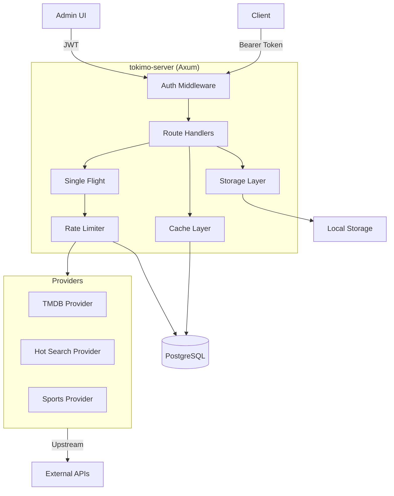

# tokimo-server

An adapter, cache, and CDN-fronting service for third-party APIs (TMDB, Baidu Hot Search, Baidu Sports, and more). Provides normalized data persistence, single-flight request deduplication, rate limiting, and asset storage.

## Features

- 🔐 **Authentication**: HTTP Bearer token validation + Admin JWT
- 🚀 **Single-Flight**: Deduplicate concurrent identical requests (process-local)
- 🌊 **Rate Limiting**: Token-bucket rate limiter persisted to PostgreSQL
- 💾 **Caching**: Database-backed caching with TTL
- 📦 **Asset Storage**: Local filesystem storage (S3/OSS stubs for future)
- 🎬 **TMDB Integration**: Movie metadata + image download
- 🔥 **Hot Search Aggregator**: Multi-source trending topics (Weibo, Bilibili, Baidu, GitHub Trending, Hacker News, V2EX)
- ⚽ **Baidu Sports**: Schedule fetching with automatic prewarm

## Tech Stack

| Layer | Technologies |
|-------|-------------|
| Backend | Rust · Axum 0.7 · Sea-ORM 1.x · PostgreSQL 16 |
| Frontend | React 19 · Vite 6 · Antd 5 · TypeScript 5 · Biome |
| Infra | Docker · GitHub Actions |

## Architecture



## Provider Status

| Provider | Status | Endpoints | Rate Limit | Cache TTL |
|----------|--------|-----------|------------|-----------|
| **TMDB** | ✅ MVP | `GET /api/tmdb/movie/:id` | 10 req/s | Persistent (DB) |
| **Baidu Hot Search** | ✅ MVP | `GET /api/hot/list?id=weibo` | Per-source | 2 min |
| **Baidu Sports** | ✅ MVP | `GET /api/sports/schedule?type=hot&date=YYYY-MM-DD` | 10 req/s | 60s |
| OMDb | 🚧 TODO | - | - | - |
| TheTVDB | 🚧 TODO | - | - | - |
| Bangumi | 🚧 TODO | - | - | - |
| Fanart.tv | 🚧 TODO | - | - | - |
| Douban | 🚧 TODO | - | - | - |
| Spotify | 🚧 TODO | - | - | - |
| MusicBrainz | 🚧 TODO | - | - | - |
| LRCLIB | 🚧 TODO | - | - | - |
| OpenSubtitles | 🚧 TODO | - | - | - |
| Assrt | 🚧 TODO | - | - | - |
| subdl | 🚧 TODO | - | - | - |
| Anna's Archive | 🚧 TODO | - | - | - |
| libgen | 🚧 TODO | - | - | - |
| OpenAlex | 🚧 TODO | - | - | - |
| arXiv | 🚧 TODO | - | - | - |
| CrossRef | 🚧 TODO | - | - | - |
| Semantic Scholar | 🚧 TODO | - | - | - |
| Open-Meteo | 🚧 TODO | - | - | - |
| Nominatim | 🚧 TODO | - | - | - |
| Wikipedia | 🚧 TODO | - | - | - |
| GitHub Releases | 🚧 TODO | - | - | - |
| Zhihu | 🚧 TODO | - | - | - |
| Juejin | 🚧 TODO | - | - | - |
| SSPai | 🚧 TODO | - | - | - |
| 36Kr | 🚧 TODO | - | - | - |
| ThePaper | 🚧 TODO | - | - | - |
| Hupu | 🚧 TODO | - | - | - |
| ITHome | 🚧 TODO | - | - | - |
| LinuxDo | 🚧 TODO | - | - | - |
| Douban Movie | 🚧 TODO | - | - | - |
| Tieba | 🚧 TODO | - | - | - |
| Douyin | 🚧 TODO | - | - | - |
| Toutiao | 🚧 TODO | - | - | - |

## Quick Start

### Development (with Docker)

```bash
# 1. Start dev database
docker compose -f docker/docker-compose.dev.yml up -d

# 2. Copy and edit .env
cp .env.example .env
# Edit DATABASE_URL, TMDB_API_KEY, etc.

# 3. Run migrations
cargo run -p tokimo-migration -- up

# 4. Start server
cargo run -p tokimo-server

# 5. Build admin UI
cd admin
pnpm install
pnpm build
cd ..

# Access http://localhost:5680/admin
```

### Production (Docker Compose)

```bash
docker compose -f docker/docker-compose.yml up -d
```

## Authentication

### Admin Login

```bash
curl -X POST http://localhost:5680/api/admin/login \
  -H "Content-Type: application/json" \
  -d '{"bootstrap_key":"YOUR_BOOTSTRAP_KEY"}'
# Returns: {"token":"JWT_TOKEN"}
```

### Create Service Key

```bash
curl -X POST http://localhost:5680/api/admin/service-keys \
  -H "Authorization: Bearer JWT_TOKEN" \
  -H "Content-Type: application/json" \
  -d '{"name":"my-app"}'
# Returns: {"token":"tks_...","id":"..."}
```

### Use Service Key

```bash
curl http://localhost:5680/api/tmdb/movie/550 \
  -H "Authorization: Bearer tks_..."
```

## Configuration

| Environment Variable | Required | Default | Description |
|---------------------|----------|---------|-------------|
| `SERVER_LISTEN` | No | `0.0.0.0:5680` | Server listen address |
| `SERVER_PUBLIC_BASE_URL` | No | `http://localhost:5680` | Public URL for assets |
| `SERVER_ADMIN_BOOTSTRAP_KEY` | Yes | - | Admin bootstrap key |
| `SERVER_JWT_SECRET` | Yes | - | JWT signing secret |
| `SERVER_CORS_ALLOWED_ORIGINS` | No | `` (permissive) | Comma-separated CORS origins |
| `DATABASE_URL` | Yes | - | PostgreSQL connection string |
| `STORAGE_BACKEND` | No | `local` | `local` / `s3` / `oss` |
| `STORAGE_LOCAL_ROOT` | Yes (local) | `./storage` | Local storage root path |
| `STORAGE_LOCAL_PUBLIC_BASE` | Yes (local) | - | Public URL prefix for assets |
| `TMDB_API_KEY` | No | - | TMDB API key (required for TMDB endpoints) |
| `RUST_LOG` | No | `info,tokimo_server=debug,sqlx=warn` | Log level |

## GitHub Secrets

For CI workflows:

| Secret | Required For | Description |
|--------|-------------|-------------|
| `TMDB_API_KEY` | Live API tests | TMDB API key for integration tests |

## Contributing

### Adding a Provider

1. Create `crates/providers/src/my_provider.rs`
2. Implement fetching logic with error handling
3. Add route handler in `crates/server/src/routes/my_provider.rs`
4. Register route in `routes/mod.rs`
5. Add database migration if needed
6. Document in README provider status table

### Code Guidelines

- No `.unwrap()` / `.expect()` in non-test code
- Always propagate errors with `?`
- DB stores object **keys**, never URLs
- URLs assembled via `Storage::url_for(key)` at response time
- Wrap upstream calls in `tracing::info_span!("upstream", provider=..., ...)`

---

## 中文文档

一个用于第三方 API（TMDB、百度热搜、百度体育等）的适配器、缓存和 CDN 前置服务。提供标准化数据持久化、单飞请求去重、速率限制和资源存储。

### 特性

- 🔐 **认证**：HTTP Bearer token 验证 + 管理员 JWT
- 🚀 **单飞机制**：去重并发的相同请求（进程内）
- 🌊 **速率限制**：令牌桶算法速率限制器，持久化到 PostgreSQL
- 💾 **缓存**：数据库支持的带 TTL 缓存
- 📦 **资源存储**：本地文件系统存储（S3/OSS 占位符）
- 🎬 **TMDB 集成**：电影元数据 + 图片下载
- 🔥 **热搜聚合器**：多源热门话题（微博、B站、百度、GitHub Trending、Hacker News、V2EX）
- ⚽ **百度体育**：赛事日程获取 + 自动预热

### 技术栈

| 层级 | 技术 |
|-----|------|
| 后端 | Rust · Axum 0.7 · Sea-ORM 1.x · PostgreSQL 16 |
| 前端 | React 19 · Vite 6 · Antd 5 · TypeScript 5 · Biome |
| 基础设施 | Docker · GitHub Actions |

### Provider 状态

（同上表）

### 快速开始

#### 开发环境（使用 Docker）

```bash
# 1. 启动开发数据库
docker compose -f docker/docker-compose.dev.yml up -d

# 2. 复制并编辑 .env
cp .env.example .env
# 编辑 DATABASE_URL、TMDB_API_KEY 等

# 3. 运行迁移
cargo run -p tokimo-migration -- up

# 4. 启动服务器
cargo run -p tokimo-server

# 5. 构建管理界面
cd admin
pnpm install
pnpm build
cd ..

# 访问 http://localhost:5680/admin
```

#### 生产环境（Docker Compose）

```bash
docker compose -f docker/docker-compose.yml up -d
```

### 认证流程

#### 管理员登录

```bash
curl -X POST http://localhost:5680/api/admin/login \
  -H "Content-Type: application/json" \
  -d '{"bootstrap_key":"YOUR_BOOTSTRAP_KEY"}'
# 返回: {"token":"JWT_TOKEN"}
```

#### 创建服务密钥

```bash
curl -X POST http://localhost:5680/api/admin/service-keys \
  -H "Authorization: Bearer JWT_TOKEN" \
  -H "Content-Type: application/json" \
  -d '{"name":"my-app"}'
# 返回: {"token":"tks_...","id":"..."}
```

#### 使用服务密钥

```bash
curl http://localhost:5680/api/tmdb/movie/550 \
  -H "Authorization: Bearer tks_..."
```

### 配置说明

（同上表）

### GitHub Secrets

用于 CI 工作流：

| Secret | 用途 | 说明 |
|--------|-----|-----|
| `TMDB_API_KEY` | Live API 测试 | TMDB API 密钥用于集成测试 |

### 贡献指南

#### 添加新 Provider

1. 创建 `crates/providers/src/my_provider.rs`
2. 实现带错误处理的获取逻辑
3. 在 `crates/server/src/routes/my_provider.rs` 添加路由处理器
4. 在 `routes/mod.rs` 注册路由
5. 如需要添加数据库迁移
6. 在 README provider 状态表中记录

#### 代码规范

- 非测试代码不使用 `.unwrap()` / `.expect()`
- 始终用 `?` 传播错误
- 数据库存储对象**键值**，不存 URL
- 响应时通过 `Storage::url_for(key)` 组装 URL
- 上游调用包裹在 `tracing::info_span!("upstream", provider=..., ...)` 中

## License

MIT
