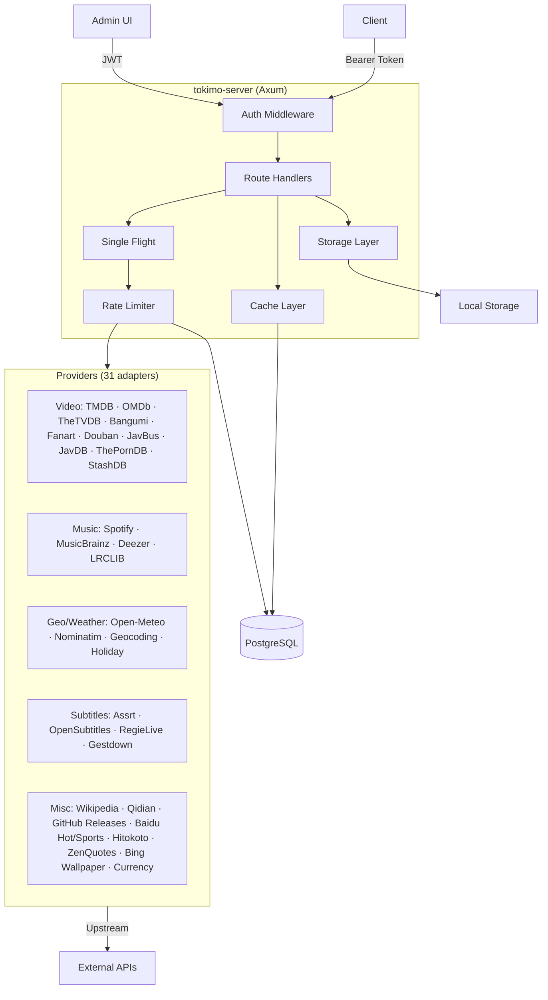

# tokimo-server

> English version: [README.md](README.md)

面向第三方 API（TMDB、百度热搜、百度体育等）的适配器、缓存与 CDN 前置服务。提供标准化数据持久化、single-flight 请求去重、速率限制和资源存储。

## 功能特性

- 🔐 **认证**：HTTP Bearer token 校验 + Admin JWT
- 🚀 **Single-Flight**：对并发的相同请求进行两层去重——进程内（DashMap）+ 跨进程（PostgreSQL `pg_advisory_xact_lock`）
- 🌊 **速率限制**：持久化到 PostgreSQL 的令牌桶速率限制器
- 💾 **缓存**：基于数据库、支持 TTL 的缓存
- 📦 **资源存储**：本地文件系统 · S3 兼容（AWS S3 / MinIO）· 阿里云 OSS
- 🎬 **32 个 Provider 适配器**：视频元数据（TMDB、OMDb、TheTVDB、Bangumi、Fanart、Douban、JavBus、JavDB、ThePornDB、StashDB）· 音乐（Spotify、MusicBrainz、Deezer、LRCLIB、**iTunes**）· 图书（Qidian）· 百科（Wikipedia）· 地理/天气（Open-Meteo、Nominatim、Geocoding）· 节假日（Timor + Nager）· 字幕（Assrt、OpenSubtitles、RegieLive、Gestdown）· 发布版本（GitHub）· 热门趋势（Baidu Hot、Baidu Sports）· 引语（Hitokoto、ZenQuotes）· 壁纸（Bing）· 汇率（exchange rates）
- 🔥 **热搜聚合器（19 个来源）**：Weibo · Bilibili · Baidu · 今日头条 · 36氪 · GitHub Trending · 掘金 · V2EX · 少数派 · 知乎热榜 · 抖音热搜 · Hacker News · 豆瓣电影 · 澎湃新闻 · 虎扑步行街 · IT之家 · 百度贴吧 · Linux.do · 网易新闻

## 技术栈

| 层级 | 技术 |
|-------|-------------|
| 后端 | Rust · Axum 0.7 · Sea-ORM 1.x · PostgreSQL 16 |
| 前端 | React 19 · Vite 6 · Antd 5 · TypeScript 5 · Biome |
| 基础设施 | Docker · GitHub Actions |

## 架构



### 跨进程 single-flight

多实例部署会分两层对并发的相同请求去重。**内层**是进程内的 `DashMap`，让同一进程中的调用方等待同一个 in-flight 任务，且无需 PostgreSQL 往返。**外层**用事务级 PostgreSQL advisory lock（`pg_advisory_xact_lock(xxh3_64(key))`）包裹本地层，使 N 个实例中只有一个进程真正访问上游 API。锁会在事务提交时自动释放（或在 panic 导致连接断开时释放），因此不会泄漏。竞态契约：handler 在 single-flight 闭包中的第一步**必须**重新检查 provider 的持久化表或共享缓存——跨进程的失败竞争者会在锁释放后醒来，并通过这次重新检查直接短路返回，而不是再次执行上游调用。

### 跨进程 Single-Flight

多实例部署下采用两层去重。**内层**是进程内的 `DashMap`，让同一进程的并发调用合并为一次 in-flight 任务，零 PG 往返。**外层**在内层之上叠加 PostgreSQL `pg_advisory_xact_lock(xxh3_64(key))`，把跨 N 个进程的并发请求收敛到只有一个进程真正打上游。锁挂在一个专用事务里，事务 commit / 连接断开时自动释放，不会泄漏。竞态契约：handler 在 single-flight 闭包里的第一步**必须**重新查 provider 持久表或共享缓存——跨进程的“输家”在锁释放后醒来，依靠这次重查直接拿到结果，而不是再打一次上游。

## Provider 状态

下面所有 31 个适配器都遵循同一模式：类型化 adapter → DB cache table → 跨进程 single-flight → 受速率限制的上游调用。

| Provider | 端点（代表性） | 速率限制 | 认证 |
|----------|----------------|------------|------|
| TMDB | `/api/tmdb/{movie,tv,season,episode,person,image}/...` | 10/s | `TMDB_API_KEY` |
| OMDb | `/api/omdb/...` | 10/s | `OMDB_API_KEY` |
| TheTVDB | `/api/thetvdb/...` | 10/s | `THETVDB_API_KEY` |
| Bangumi | `/api/bangumi/...` | 10/s | `BANGUMI_USER_AGENT` |
| Fanart | `/api/fanart/...` | 10/s | `FANART_API_KEY` |
| Douban | `/api/douban/...` | 1/s | scraping（无 key） |
| JavBus | `/api/javbus/search?video_id=` | 5/s | `JAVBUS_BASE_URL`（可选 `JAVBUS_COOKIE`） |
| JavDB | `/api/javdb/search?video_id=` | 5/s | `JAVDB_BASE_URL`（可选 `JAVDB_COOKIE`） |
| ThePornDB | `/api/tpdb/search?video_id=` | 5/s | `TPDB_API_KEY` + `TPDB_BASE_URL` |
| StashDB | `/api/stashdb/search?video_id=` | 5/s | `STASHDB_BASE_URL`（可选 `STASHDB_API_KEY`） |
| Spotify | `/api/spotify/...` | 30/s | `SPOTIFY_CLIENT_ID` + `SPOTIFY_CLIENT_SECRET` |
| MusicBrainz | `/api/musicbrainz/...` | 1/s | `MUSICBRAINZ_USER_AGENT` |
| Deezer | `/api/deezer/...` | 30/s | 无 |
| LRCLIB | `/api/lrclib/...` | 30/s | 无 |
| Qidian | `/api/qidian/book/:id`, `/api/qidian/search` | 1/s | scraping（无 key） |
| Wikipedia | `/api/wikipedia/summary?title=&lang=` | 10/s | 无 |
| Open-Meteo | `/api/openmeteo/{forecast,air-quality}` | 100/s | 无 |
| Nominatim | `/api/nominatim/{search,reverse}` | **1/s**（TOS） | `NOMINATIM_USER_AGENT` |
| Geocoding | `/api/geocoding/{forward,reverse}`（组合） | 30/s | 复用 Nominatim UA |
| Holiday | `/api/holiday/:country/:year`（Timor + Nager 合并） | 10/s | 无 |
| Assrt | `/api/assrt/{search,sub/:id/detail}` | 10/s | `ASSRT_API_KEY` |
| OpenSubtitles | `/api/opensubtitles/search` | 10/s | `OPENSUBTITLES_API_KEY` |
| RegieLive | `/api/regielive/search` | 10/s | 无（硬编码 Bazarr UA + key） |
| Gestdown | `/api/gestdown/{shows/search,subtitles}` | 10/s | 无 |
| GitHub Releases | `/api/github/releases/:owner/:repo/{latest,list}` | 30/s | 可选 `GITHUB_TOKEN` |
| Baidu Hot | `/api/hot/list?id=...`（19 个来源，见下文）· `/api/hot/sources` | 按来源 | 无 |
| Baidu Sports | `/api/sports/schedule?...` | 10/s | 无 |
| Hitokoto | `/api/hitokoto/sentence` | 10/s | 无 |
| ZenQuotes | `/api/zenquotes/random` | 10/s | 无 |
| Bing Wallpaper | `/api/bing/wallpaper` | 10/s | 无 |
| Currency | `/api/currency/rates` | 10/s | 无 |
| iTunes | `/api/itunes/album-cover?artist=&album=` | 5/s | 无 |

### 热搜来源（`/api/hot/list?id=<source>`）

| id | 名称 | 上游 |
|---|---|---|
| `weibo` | 微博热搜 | s.weibo.com |
| `bilibili` | B站热门 | api.bilibili.com |
| `baidu` | 百度热搜 | top.baidu.com |
| `toutiao` | 今日头条 | toutiao.com/hot-event/hot-board |
| `36kr` | 36氪 | gateway.36kr.com |
| `github` | GitHub Trending | github.com/trending |
| `juejin` | 掘金 | api.juejin.cn |
| `v2ex` | V2EX | v2ex.com/api/topics/hot.json |
| `sspai` | 少数派 | sspai.com |
| `zhihu` | 知乎热榜 | zhihu.com |
| `douyin` | 抖音热搜 | douyin.com |
| `hackernews` | Hacker News | hacker-news.firebaseio.com |
| `douban-movie` | 豆瓣电影 | movie.douban.com |
| `thepaper` | 澎湃新闻 | cache.thepaper.cn |
| `hupu` | 虎扑步行街 | bbs.hupu.com |
| `ithome` | IT之家 | m.ithome.com |
| `tieba` | 百度贴吧 | tieba.baidu.com/hottopic |
| `linuxdo` | Linux.do | linux.do/top.json（⚠ Cloudflare 可能对非中国出口返回 403） |
| `netease-news` | 网易新闻 | m.163.com/fe/api/hot/news/flow |

## 环境变量

服务器 / 数据库 / 存储相关环境变量列在[配置](#配置)中。下面是 **provider 认证**环境变量；缺失的变量会禁用对应路由（或对支持匿名模式的 provider 回退到匿名模式）。

| 变量 | 被谁要求 | 说明 |
|----------|-------------|-------|
| `TMDB_API_KEY` | required | TMDB v3 API key |
| `OMDB_API_KEY` | required | OMDb apikey |
| `THETVDB_API_KEY` | required | TheTVDB v4 API key（server 会交换为 JWT） |
| `BANGUMI_USER_AGENT` | required | Bangumi 根据其 TOS 要求描述性 UA |
| `FANART_API_KEY` | required | fanart.tv 项目 API key |
| `SPOTIFY_CLIENT_ID` | required | Spotify app client id（client_credentials flow） |
| `SPOTIFY_CLIENT_SECRET` | required | 与 `SPOTIFY_CLIENT_ID` 配套 |
| `MUSICBRAINZ_USER_AGENT` | required | MusicBrainz 根据其 TOS 要求包含联系方式的 UA |
| `NOMINATIM_USER_AGENT` | required | OSM Nominatim 要求包含联系方式的 UA；**也被 `/api/geocoding` 复用** |
| `ASSRT_API_KEY` | required | assrt.net 字幕 API token |
| `OPENSUBTITLES_API_KEY` | required for `/api/opensubtitles` | OpenSubtitles consumer key — 在 https://www.opensubtitles.com/en/consumers 注册 |
| `GITHUB_TOKEN` | optional | 提高 GitHub 匿名速率限制（60/h → 5000/h） |

## 快速开始

### 开发环境（使用 Docker）

```bash
# 1. 启动开发数据库
docker compose -f docker/docker-compose.dev.yml up -d

# 2. 复制并编辑 .env
cp .env.example .env
# 编辑 DATABASE_URL、TMDB_API_KEY 等

# 3. 运行迁移
cargo run -p tokimo-migration -- up

# 4. 启动服务器
cargo run -p tokimo-server

# 5. 构建管理 UI
cd admin
pnpm install
pnpm build
cd ..

# 访问 http://localhost:5680/admin
```

### 生产环境（Docker Compose）

```bash
docker compose -f docker/docker-compose.yml up -d
```

## 认证

### Admin 登录

```bash
curl -X POST http://localhost:5680/api/admin/login \
  -H "Content-Type: application/json" \
  -d '{"bootstrap_key":"YOUR_BOOTSTRAP_KEY"}'
# 返回: {"token":"JWT_TOKEN"}
```

### 创建 Service Key

```bash
curl -X POST http://localhost:5680/api/admin/service-keys \
  -H "Authorization: Bearer JWT_TOKEN" \
  -H "Content-Type: application/json" \
  -d '{"name":"my-app"}'
# 返回: {"token":"tks_...","id":"..."}
```

### 使用 Service Key

```bash
curl http://localhost:5680/api/tmdb/movie/550 \
  -H "Authorization: Bearer tks_..."
```

## 配置

| 环境变量 | 必填 | 默认值 | 描述 |
|---------------------|----------|---------|-------------|
| `SERVER_LISTEN` | 否 | `0.0.0.0:5680` | 服务器监听地址 |
| `SERVER_PUBLIC_BASE_URL` | 否 | `http://localhost:5680` | 资源的公开 URL |
| `SERVER_ADMIN_BOOTSTRAP_KEY` | 是 | - | Admin bootstrap key |
| `SERVER_JWT_SECRET` | 是 | - | JWT 签名密钥 |
| `SERVER_CORS_ALLOWED_ORIGINS` | 否 | ``（宽松） | 逗号分隔的 CORS origins |
| `DATABASE_URL` | 是 | - | PostgreSQL connection string |
| `STORAGE_BACKEND` | 否 | `local` | `local` / `s3` / `oss` |
| `STORAGE_LOCAL_ROOT` | 是（local） | `./storage` | 本地存储根路径 |
| `STORAGE_LOCAL_PUBLIC_BASE` | 是（local） | - | 资源公开 URL 前缀 |
| `TMDB_API_KEY` | 否 | - | TMDB API key（TMDB 端点必需） |
| `RUST_LOG` | 否 | `info,tokimo_server=debug,sqlx=warn` | 日志级别 |

### 存储后端

通过 `STORAGE_BACKEND` 选择。数据库始终存储对象 **keys**；URL 会在响应时通过 `Storage::url_for(key)`（async）组装。

| 后端 | 适用场景 | 必需环境变量 |
|---|---|---|
| `local` | 单节点开发 / 带反向代理的自托管 | `STORAGE_LOCAL_ROOT`, `STORAGE_LOCAL_PUBLIC_BASE` |
| `s3` | AWS S3 / MinIO / 任意 S3 兼容服务 | `STORAGE_S3_BUCKET`, `STORAGE_S3_REGION`, `STORAGE_S3_ACCESS_KEY_ID`, `STORAGE_S3_SECRET_ACCESS_KEY`, 可选 `STORAGE_S3_ENDPOINT`（AWS 省略）, `STORAGE_S3_PUBLIC_BASE`（公开访问时）, `STORAGE_S3_PRESIGN_TTL_SECONDS`（默认 `0`） |
| `oss` | 阿里云 OSS（S3 兼容协议） | `STORAGE_OSS_BUCKET`, `STORAGE_OSS_REGION`, `STORAGE_OSS_ACCESS_KEY_ID`, `STORAGE_OSS_SECRET_ACCESS_KEY`, 可选 `STORAGE_OSS_ENDPOINT`（默认 `https://oss-cn-hangzhou.aliyuncs.com`）, `STORAGE_OSS_PUBLIC_BASE`, `STORAGE_OSS_PRESIGN_TTL_SECONDS` |

`PRESIGN_TTL_SECONDS=0` ⇒ bucket 会被视为公开；`url_for` 返回 `{public_base}/{key}`。`>0` ⇒ bucket 是私有的；`url_for` 返回有效期为对应秒数的 presigned GET URL。

## 运维

### 数据库压缩

PostgreSQL JSONB 列（`hot_search_snapshots.data`、provider response payloads 等）在值足够大、需要溢出到行外存储时会使用 TOAST 压缩。迁移 `m20250101_000069_jsonb_lz4_compression`（000069）把全部 44 个 JSONB 列从 PostgreSQL 默认的 `pglz` 设置切换到 `lz4`，但只影响**新写入**。现有行在被重写前会保留原本的压缩格式。

要重新压缩现有表：

```sql
VACUUM FULL table_name;  -- ⚠️ 会获取 ACCESS EXCLUSIVE 锁；请安排在维护窗口执行
```

**需要运维人员决策**：VACUUM FULL 会重建整张表并阻塞所有访问。对于大表（GB+），请考虑在低峰期执行，或接受通过自然 UPDATE/DELETE churn 逐步迁移。

### 索引卫生

定期运行 [`docs/db-audit.sql`](./docs/db-audit.sql)（或集成到监控中）以检测：

1. **未使用索引**——生产中从未命中，可安全删除
2. **顺序扫描热点**——缺失索引的候选位置
3. **表大小**——每张表 / 每个索引的磁盘占用
4. **TOAST 压缩验证**——确认 lz4 与 pglz 的使用情况
5. **重复索引**——冗余定义

迁移 `m20250101_000070_index_cleanup`（000070）移除了 `hot_search_snapshots(source)` 和 `(fetched_at)` 两个单列索引，并用覆盖两个维度的复合索引 `(source, fetched_at DESC)` 替代。

### 缓存清理

后台任务每 24 小时清扫一次过期行（可通过 `SERVER_CACHE_CLEANUP_INTERVAL_HOURS` 配置，首次运行在启动 5 分钟后）。实现在 `crates/server/src/jobs/cache_cleanup.rs`。

| 保留层级 | TTL | 表 |
|----------------|-----|--------|
| **易变** | 1 day | `hot_search_snapshots`, `hot_search_items`, `currency_rates`, `openmeteo_forecasts`, `zenquotes_cache`, `hitokoto_cache`, `bing_wallpaper_cache` |
| **短期** | 7 days | `github_releases`, `gestdown_cache`, `regielive_cache`, `shooter_cache`, `animetosho_cache`, `assrt_searches`, `assrt_sub_details`, `opensubtitles_cache`, `lrclib_lyrics` |
| **中期** | 30 days | `sport_matches`, `holiday_years`, `geocoding_results`, `nominatim_geocode` |
| **永久** | ♾️ never deleted | `tmdb_*`, `omdb_titles`, `thetvdb_*`, `bangumi_subjects`, `fanart_assets`, `douban_subjects`, `spotify_*`, `deezer_*`, `musicbrainz_*`, `qidian_books`, `wikipedia_summaries`, `itunes_cache` |

此外还会清理：

```sql
DELETE FROM cache_entries WHERE expires_at < now();
```

**控制项：**
- `SERVER_CACHE_CLEANUP_ENABLED`（默认 `true`）——设为 `false` 可禁用
- `SERVER_CACHE_CLEANUP_INTERVAL_HOURS`（默认 `24`）——清扫间隔

### Admin Operations Tab

计划中：`/admin` → “CDN 运维”标签页将提供：

- 压缩概览（按表展示 lz4 与 pglz 比例）
- 表大小与行数
- 每张表最早的 `fetched_at` 时间戳
- 手动清理触发器
- 最近一次运行统计（删除行数、耗时）

实现状态见 [`docs/cdn-roadmap.md`](./docs/cdn-roadmap.md)。

### 手动运维速查表

```bash
# 检查 JSONB 列配置的 TOAST 压缩方式

docker exec tokimo-postgres psql -U postgres -d tokimo_db -c "
SELECT attrelid::regclass AS table_name,
       attname AS column_name,
       CASE attcompression
         WHEN 'l' THEN 'lz4'
         WHEN 'p' THEN 'pglz'
         ELSE 'default'
       END AS compression
FROM pg_attribute
WHERE attnum > 0
  AND NOT attisdropped
  AND atttypid = 'jsonb'::regtype
ORDER BY 1, 2;"

# 查看每张表的行数与最早记录
docker exec tokimo-postgres psql -U postgres -d tokimo_db -c "
SELECT 'hot_search_snapshots' AS table,
       count(*) AS rows,
       min(fetched_at) AS oldest
FROM hot_search_snapshots
UNION ALL
SELECT 'tmdb_profiles', count(*), min(updated_at) FROM tmdb_profiles
UNION ALL
SELECT 'currency_rates', count(*), min(fetched_at) FROM currency_rates;"

# 手动触发清理（Admin UI 上线前的 SQL fallback）
docker exec tokimo-postgres psql -U postgres -d tokimo_db -c "
DELETE FROM hot_search_snapshots WHERE fetched_at < now() - interval '1 day';
DELETE FROM hot_search_items WHERE fetched_at < now() - interval '1 day';
DELETE FROM github_releases WHERE fetched_at < now() - interval '7 days';
DELETE FROM cache_entries WHERE expires_at < now();"

# VACUUM 建议
docker exec tokimo-postgres psql -U postgres -d tokimo_db -c "
SELECT schemaname, tablename,
       last_vacuum, last_autovacuum,
       n_dead_tup, n_live_tup,
       CASE WHEN n_live_tup > 0
            THEN round(100.0 * n_dead_tup / n_live_tup, 2)
            ELSE 0 END AS dead_ratio
FROM pg_stat_user_tables
WHERE n_dead_tup > 1000 OR (n_live_tup > 0 AND n_dead_tup::float / n_live_tup > 0.2)
ORDER BY n_dead_tup DESC;"
```

## GitHub Secrets

用于 CI workflows：

| Secret | 适用场景 | 描述 |
|--------|-------------|-------------|
| `TMDB_API_KEY` | Live API tests | 用于集成测试的 TMDB API key |

## 贡献指南

### 添加 Provider

1. 创建 `crates/providers/src/my_provider.rs`
2. 实现带错误处理的获取逻辑
3. 在 `crates/server/src/routes/my_provider.rs` 中添加 route handler
4. 在 `routes/mod.rs` 中注册 route
5. 如有需要，添加数据库 migration
6. 在 README provider status table 中记录

### 代码规范

- 非测试代码中不要使用 `.unwrap()` / `.expect()`
- 始终使用 `?` 传播错误
- DB 存储对象 **keys**，绝不存 URL
- 响应时通过 `Storage::url_for(key).await` 组装 URL
- 将上游调用包裹在 `tracing::info_span!("upstream", provider=..., ...)` 中

---

## 中文文档

一个用于第三方 API（TMDB、百度热搜、百度体育等）的适配器、缓存和 CDN 前置服务。提供标准化数据持久化、单飞请求去重、速率限制和资源存储。

### 特性

- 🔐 **认证**：HTTP Bearer token 验证 + 管理员 JWT
- 🚀 **单飞机制**：去重并发的相同请求（进程内）
- 🌊 **速率限制**：令牌桶算法速率限制器，持久化到 PostgreSQL
- 💾 **缓存**：数据库支持的带 TTL 缓存
- 📦 **资源存储**：本地文件系统 · S3 兼容（AWS S3 / MinIO）· 阿里云 OSS
- 🎬 **TMDB 集成**：电影元数据 + 图片下载
- 🔥 **热搜聚合器**：多源热门话题（微博、B站、百度、GitHub Trending、Hacker News、V2EX）
- ⚽ **百度体育**：赛事日程获取 + 自动预热

### 技术栈

| 层级 | 技术 |
|-----|------|
| 后端 | Rust · Axum 0.7 · Sea-ORM 1.x · PostgreSQL 16 |
| 前端 | React 19 · Vite 6 · Antd 5 · TypeScript 5 · Biome |
| 基础设施 | Docker · GitHub Actions |

### Provider 状态

（同上表）

### 快速开始

#### 开发环境（使用 Docker）

```bash
# 1. 启动开发数据库
docker compose -f docker/docker-compose.dev.yml up -d

# 2. 复制并编辑 .env
cp .env.example .env
# 编辑 DATABASE_URL、TMDB_API_KEY 等

# 3. 运行迁移
cargo run -p tokimo-migration -- up

# 4. 启动服务器
cargo run -p tokimo-server

# 5. 构建管理界面
cd admin
pnpm install
pnpm build
cd ..

# 访问 http://localhost:5680/admin
```

#### 生产环境（Docker Compose）

```bash
docker compose -f docker/docker-compose.yml up -d
```

### 认证流程

#### 管理员登录

```bash
curl -X POST http://localhost:5680/api/admin/login \
  -H "Content-Type: application/json" \
  -d '{"bootstrap_key":"YOUR_BOOTSTRAP_KEY"}'
# 返回: {"token":"JWT_TOKEN"}
```

#### 创建服务密钥

```bash
curl -X POST http://localhost:5680/api/admin/service-keys \
  -H "Authorization: Bearer JWT_TOKEN" \
  -H "Content-Type: application/json" \
  -d '{"name":"my-app"}'
# 返回: {"token":"tks_...","id":"..."}
```

#### 使用服务密钥

```bash
curl http://localhost:5680/api/tmdb/movie/550 \
  -H "Authorization: Bearer tks_..."
```

### 配置说明

（环境变量同上表）

#### 存储后端

通过 `STORAGE_BACKEND` 选择。数据库只存对象 **key**，URL 在响应时通过 `Storage::url_for(key)`（async）组装。

| 后端 | 适用场景 | 必填环境变量 |
|---|---|---|
| `local` | 单机开发 / 反向代理自部署 | `STORAGE_LOCAL_ROOT`、`STORAGE_LOCAL_PUBLIC_BASE` |
| `s3` | AWS S3 / MinIO / 其他 S3 兼容服务 | `STORAGE_S3_BUCKET`、`STORAGE_S3_REGION`、`STORAGE_S3_ACCESS_KEY_ID`、`STORAGE_S3_SECRET_ACCESS_KEY`、可选 `STORAGE_S3_ENDPOINT`（AWS 留空）、`STORAGE_S3_PUBLIC_BASE`（公有桶必填）、`STORAGE_S3_PRESIGN_TTL_SECONDS`（默认 `0`） |
| `oss` | 阿里云 OSS（S3 兼容协议） | `STORAGE_OSS_BUCKET`、`STORAGE_OSS_REGION`、`STORAGE_OSS_ACCESS_KEY_ID`、`STORAGE_OSS_SECRET_ACCESS_KEY`、可选 `STORAGE_OSS_ENDPOINT`（默认 `https://oss-cn-hangzhou.aliyuncs.com`）、`STORAGE_OSS_PUBLIC_BASE`、`STORAGE_OSS_PRESIGN_TTL_SECONDS` |

`PRESIGN_TTL_SECONDS=0` ⇒ 公有桶，`url_for` 返回 `{public_base}/{key}`；`>0` ⇒ 私有桶，`url_for` 返回有效期为该秒数的预签名 GET URL。


### GitHub Secrets

用于 CI 工作流：

| Secret | 用途 | 说明 |
|--------|-----|-----|
| `TMDB_API_KEY` | Live API 测试 | TMDB API 密钥用于集成测试 |

### 贡献指南

#### 添加新 Provider

1. 创建 `crates/providers/src/my_provider.rs`
2. 实现带错误处理的获取逻辑
3. 在 `crates/server/src/routes/my_provider.rs` 添加路由处理器
4. 在 `routes/mod.rs` 注册路由
5. 如需要添加数据库迁移
6. 在 README provider 状态表中记录

#### 代码规范

- 非测试代码不使用 `.unwrap()` / `.expect()`
- 始终用 `?` 传播错误
- 数据库存储对象**键值**，不存 URL
- 响应时通过 `Storage::url_for(key).await` 组装 URL
- 上游调用包裹在 `tracing::info_span!("upstream", provider=..., ...)` 中

## License

MIT
